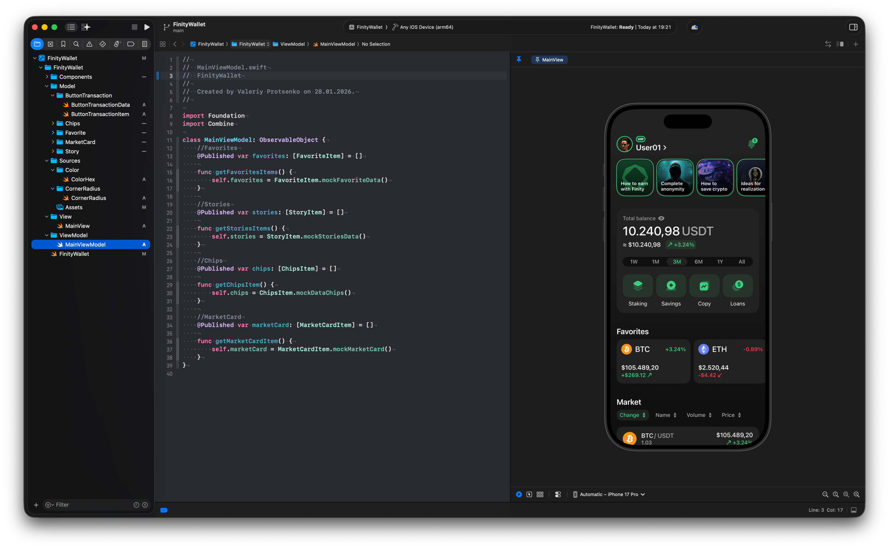

# FinityWallet

SwiftUI crypto wallet app with market data, favorites, stories, 
and balance overview. Built with Combine for reactive state 
management and MVVM architecture.

## Preview

## Features

- Balance overview with portfolio chart
- Market data with sorting (Change, Name, Volume, Price)
- Favorites with crypto pairs
- Stories feed
- Quick actions: Staking, Savings, Copy, Loans
- Reusable component system with color tokens
- Reactive state management with Combine

## Stack

- Swift
- SwiftUI
- Combine
- MVVM
- Color Tokens
- Mock Data

## Design

Designed in Figma before development.  
[View Figma Mockup →](https://www.figma.com/design/QK961iwJ7mZQV7nwrAF6a7/Pojects?node-id=0-1)

## Author

Valeriy Protsenko — iOS Design Engineer  
[LinkedIn](https://www.linkedin.com/in/valprotsenko) · 
[Website](https://lerix.pro/?lang=en) · 
[Telegram](https://t.me/vallerqq)
